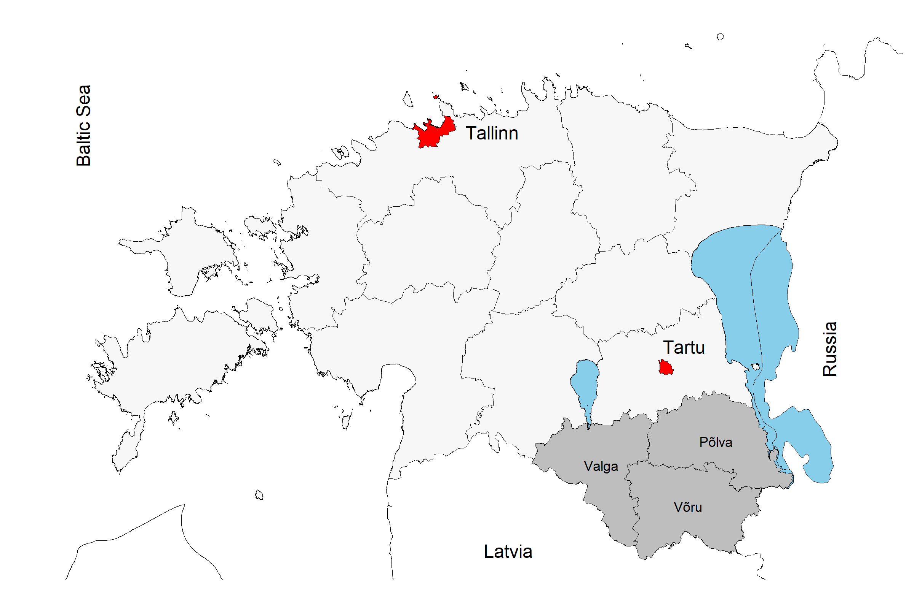

# estonian_contour_maps
## Create contour maps of Estonia / Loo Eesti kontuurkaarte

***
Example/Näide:

***

Creates Estonian county countour map with:
* two lakes (Peipsi and Võrtsjärv),
* some towns (Tallinn and Tartu),
* some counties labeled,
* and neighbouring countries and Baltic Sea.

Map will be saved as PNG and PDF.
***
Teeb Eesti maakondade kontuurkaardi koos:
* kahe järve (Peipsi järv ja Võrtsjärv),
* mõne linnaga (Tallinn, Tartu),
* mõned maakonnad on eraldi märgitud
* ja naaber riigid ning Läänemeri on eraldi märgitud.

Kaart salvestatakse PNG ja PDF-na.
***
Usage:
* Open file "estonia_county_contour.R" in R or RStudio
* Modify script
* Run script
***
Kasutamine:
* Ava fail "estonia_county_contour.R" R-s või RStudio-s
* Muuda koodi
* Jooksuta koodi
